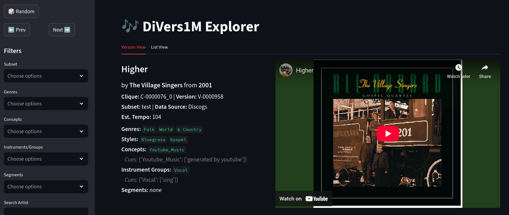

# Diverse Versions Dataset

[](https://doi.org/10.5281/zenodo.18017350)

A suite of two datasets, based on the ([*Discogs-VI-YT*](https://github.com/MTG/discogs-vi-dataset)) dataset. Namely:
- *Diverse Versions Large (DiVers-L)*: contains versions found on YouTube without being constrained to listings on *Discogs* or *Secondhandsongs*.
- *Diverse Versions Small (DiVers-S)*: A subset of *DiVers-L*, restricted to segments where music tags appear in the YouTube video title.

## Explorer
Discover our dataset in our [explorer app](https://divers.streamlit.app/).


## Conda Environment
- installation of the conda environment by running  `conda env create -f env.yml`

## Dataset Creation
### Requirements
- the original *DVI* dataset files `Discogs-VI-YT-20240701.jsonl` and `Discogs-VI-YT-20240701-light.json` 
- installed requirements in `env.yml`
### Extract titles from Discogs-VI-YT 
First, please save the *DVI* dataset files in `data/dvi/`. To obtain one query (song title) per clique, we first create a new file. We use the cleaned song titles from *Discogs-VI-YT*.
```
python scripts/creation/get_unique_titles.py data/dvi/Discogs-VI-YT-20240701.jsonl data/aux/one_title_per_clique.json
```
### Search on YouTube
We now search for up to 500 results per clique, using the text query (song title).
```
python scripts/creation/search_youtube.py data/aux/one_title_per_clique.json data/youtube/ 
```
### Filtering
#### Exclude dataset matches
We exclude videos which are also contained as versions in any of the datasets [*Discogs-VI-YT*](https://github.com/MTG/discogs-vi-dataset), [*SHS100K2*](https://github.com/NovaFrost/SHS100K2) or [*Da-Tacos*](https://github.com/MTG/da-tacos). Please note that we have our own CSV files for this process which we can provide upon request. Given these files, we run:

```
python scripts/creation/filter_youtube_ids.py data/youtube data/filter/youtube_id --discogs_path data/dvi/Discogs-VI-YT-20240701-light.json --shs_csv_path ../data/shs100k2.csv --datacos_csv_path ../data/da-tacos.csv
```
#### Exclude videos by duration
We exclude videos longer than 20 minutes (like in *Discogs-VI-YT*) and under 10 seconds.
```
python scripts/creation/filter_duration.py data/youtube data/filter/duration --min 10 --max 1200
```
#### Filter by result index
```
python scripts/creation/filter_rank.py data/youtube data/filter/rank --max_index 100
```
#### Obtain one `jsonl` file 
```
python scripts/creation/join_to_one.py data/youtube data --filter_dir data/filter
```
This creates the files `metadata_filtered.jsonl` where only the kept videos after filtering are contained and each video is contained only once. To not lose the information related to the queries, we also generate `queries_filtered.json`, which maps the YouTube identifiers to the text queries where they occur and the respective result index.
#### Filter by fuzzy matching
##### Method
This step aims at detecting videos which are likely versions of the works in the seed dataset. For each song title and its video results, we match the respective song title and artist name by fuzzy matching.
We also apply some pre-processing steps (see `string_processor.py`) which were also used to generate [MusicUGC-NER](https://github.com/progsi/YTUnCoverLLM/tree/main?tab=readme-ov-file).
```
python scripts/creation/fuzzy_matching.py data/dvi/Discogs-VI-YT-20240701.jsonl data/aux/one_title_per_clique.json data/matched/full.csv
```
##### Analysis
From the output file in `data/full.csv`, we analyze the matches with regards to pairs of attributes from *Discogs* and *YouTube* which are matched in the notebook `matching_analysis.ipynb`. Additionally, we split the data into four groups after thresholding the similarity at 80%:
- *both*: *title* and *artist* are matched
- *only_title*: the cleaned title from *Discogs-VI-YT* matches
- *only_artist*: any artist is matched using the list of artists from *Discogs*
- *none*
For the whole set, this information is written to `data/filtered_types.csv`. We additionally create a sample of 100 videos per group to check manually.

Manually checking the sample, we observed that *both* contains references to the work of interest in almost all of the cases (>95%). Additionally, *none* and *only_title* mostly contain references to other works and *only_artist* mostly contain references of works from the same artist related to the work of interest. 

**Based on our analysis we decide to only keep the *both* subset, since it is already large (1.4M videos) and the matching quality is rather high.**

### Make splits
In `make_splits.ipynb` we make two subsets. First, the full *both* dataset. We further create another filtered version were we filter some indicators of official music videos (e.g. *remastered* etc.). 
The outputs are written to `data/dataset` and contain json files containing only the new versions as well as dataset files which contain versions of `Discogs-VI-YT` and the new versions which are usable to train models. 
Afterwards, we create the splits, which creates `json` and `jsonl` files in a format like in *DVI*:
```
python scripts/creation/make_splits2.py data/dataset/dvi_fm_filtered.jsonl data/discogs/ data/dataset/ --use-split-content
```
### Transform to CLEWS format
We transform the obtained formats to the one used in [clews](https://github.com/sony/clews/). Here, we require the downloaded audio files (see below for information on downloading audio files). We now assume, these downloaded files are under `data/audio`.
```
python scripts/creation/prepare_for_clews.py --path_meta `data/dataset/` --path_audio data/audio/ --fn_out data/divers.pt
```
This creates a torch file called `divers.pt` in the desired format.
#### Add rich metadata to the file
Given this torch file and the YouTube crawl and our Discogs metadata file, we can run:
```
python scripts/creation/collect_metadata.py --audio-dir /data/audio/ --dvi-file ../discogs-vi-2/data/dvi2/dataset/divers1m/dvi_fm.jsonl --meta-file ../clews/cache/divers.pt --njobs 32
```

Afterwards we match auxiliary data (e.g., tags):

```
python scripts/creation/match_tags_tempo.py --input ../clews/cache/divers.pt --output data/final/divers.pt
```
And to deduplicate, we use the [respective notebook](scripts/deduplication/deduplication.ipynb). 

### Add sound event tags
Required: A JSON file with YouTube-IDs mapping to the sound event lists. These are lists with 1s indicating clean music segments and 0s indicating a non-music segment (e.g. speech, noise, silence).

```
python scripts/creation/join_soundevent_inds.py data/final/ data/music-tagging-output.json -o /data/final_se/
```
### Download
Some tips regarding MP3 downloads are given in [*Discogs-VI-YT*](https://github.com/MTG/discogs-vi-dataset). The estimated time to download everything (when using 8 parallel downloads at a time), is around 12-18 days. 
